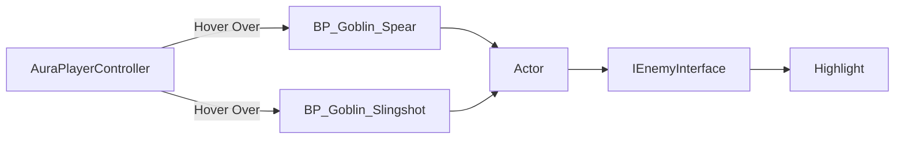
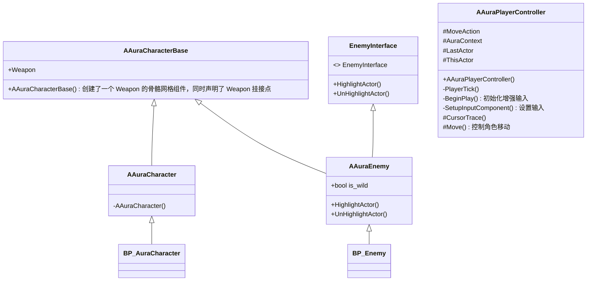

## 1. Create Project

项目设置：


## 2. 类

### 2.1 代码结构

- `AuraCharacter.cpp`
- `TObjectPtr`：UE5 新增指针类型，相比 `UObject*` 更好地支持 GC 与序列化。
- `AuraCharacterBase`：`Character` 基类，创建了 `Weapon` 的骨骼网格组件，同时声明了 `Weapon` 挂接点。
- `AuraCharacter`：主角类。
- `AuraEnemy`：敌人类的父类，继承自 `AuraCharacter`。

### 2.2 蓝图

- `BP_Aura_Character`
- `ABP_Aura_Character`
- `ABP_Enemy`：敌人动画蓝图模板基类，不需要指定骨骼，不同敌人复用其中的动画播放速度逻辑。
- `ABP_Goblin_Slingshot`：设置指定敌人持有 Slingshot 的动画。
- `ABP_Goblin_Spear`：设置指定敌人持有 Spear 的动画。

## 3. 增强输入

参考文档：
https://dev.epicgames.com/documentation/zh-cn/unreal-engine/configure-character-movement-with-cplusplus-in-unreal-engine?application_version=5.6

### 3.1 Aura.Build.cs 中添加 EnhancedInput 模块

### 3.2 创建 IA 和 IMC

1. `IA_Move`：设置输入值类型（float / bool / vector2 / vector3）。
2. `IMC_...`：设置 `IA_Move` 的按键（WASD）及 modifier。

Swizzle Input Axis Values。

### 3.3 AuraPlayerController

- Enhanced Input system：用于管理 IA 与 IMC。
- 获取 Enhanced Input system 并添加 IMC。
- 在 `SetupInputComponent()` 中绑定 `IA_Move` 与 `Move`。

绑定示例：

```
EnhancedInputComponent->BindAction(MoveAction, ETriggerEvent::Triggered, this, &AAuraPlayerController::Move);
```

### 3.4 绑定 IA_Move 到 Move 响应函数

```cpp
void AAuraPlayerController::SetupInputComponent()
{
    Super::SetupInputComponent();

    // 1. 获取 Enhanced Input system
    UEnhancedInputLocalPlayerSubsystem* Subsystem =
        ULocalPlayer::GetSubsystem<UEnhancedInputLocalPlayerSubsystem>(GetLocalPlayer());
    // 2. 获取 IA_Move
    UInputMappingContext* IA_Move = LoadObject<UInputMappingContext>(
        nullptr, TEXT("InputMappingContext'/Game/Input/IMC_Move.IMC_Move'"));
    // 3. 将 IA_Move 添加到 Enhanced Input system 中
    if (Subsystem && IA_Move)
    {
        Subsystem->AddMappingContext(IA_Move, 0);
    }
    // 4. 绑定 IA_Move 到 Move 响应函数
    UEnhancedInputComponent* EnhancedInputComponent = Cast<UEnhancedInputComponent>(InputComponent);
    if (EnhancedInputComponent && MoveAction)
    {
        EnhancedInputComponent->BindAction(MoveAction, ETriggerEvent::Triggered, this,
                                           &AAuraPlayerController::Move);
    }
}
```

```cpp
void AAuraPlayerController::Move(const FInputActionValue& InputActionValue)
{
    const FVector2D InputAxisVector = InputActionValue.Get<FVector2D>();

    const FRotator Rotation = GetControlRotation();
    const FRotator YawRotation(0.f, Rotation.Yaw, 0.f);

    const FVector ForwardDirection = FRotationMatrix(YawRotation).GetUnitAxis(EAxis::X);
    const FVector RightDirection = FRotationMatrix(YawRotation).GetUnitAxis(EAxis::Y);

    if (APawn* ControlledPawn = GetPawn<APawn>())
    {
        ControlledPawn->AddMovementInput(ForwardDirection, InputAxisVector.Y);
        ControlledPawn->AddMovementInput(RightDirection, InputAxisVector.X);
    }
}
```

## Game Mode

- `GameModeBase` 类：C++ `AuraGameModeBase`，蓝图 `BP_Aura_GameMode`，设置默认 Pawn 和 Controller。
- 在 World Settings 中设置 GameMode。
- 在 `BP_AuraCharacter` 中设置弹簧臂与相机。
- 在 `AuraCharacter` 中设置角色朝向为移动方向。
- `ABP_Aura` 动画状态机：根据速度在 idle/run 之间切换。

## Enemy Interface




