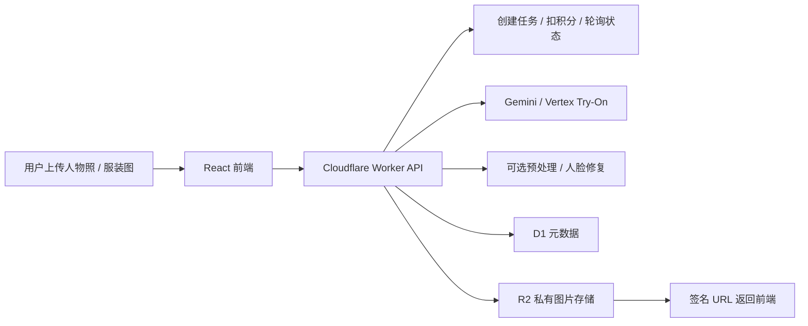
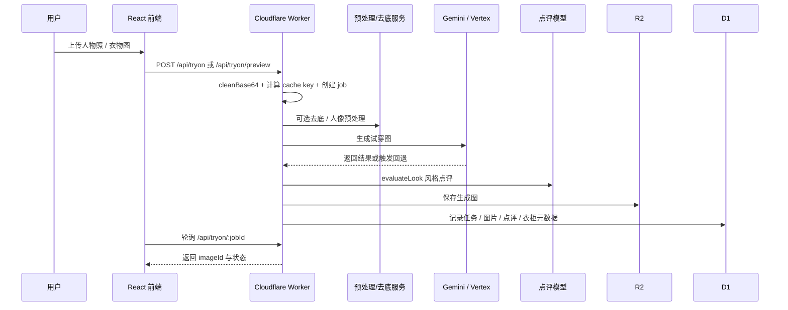

> 电商入口正在从「用户自己逛」迁移到「Agent 帮用户选」；Try on 个人衣柜则把 AI 试穿、个人衣柜与推荐串成一条可落地的转化链路。

## AI 时代的电商转型

### 一个核心变化

过去电商买衣服，主路径是：

1. 用户打开 App 或网页。
2. 用户自己搜索、筛选、对比。
3. 商家通过投流、关键词和活动位争夺曝光。

AI Agent 出现后，入口开始变化：

1. 用户先告诉 Agent 需求（预算、尺码、风格、场景）。
2. Agent 去多平台检索、比价、过滤。
3. Agent 只把少量「候选结果」返回给用户。

这意味着，商家不再只是「面向人类页面」，而是必须「面向 Agent 决策」。

### 旧电商逻辑：买流量

传统玩法的核心是曝光竞争：

- 买广告位和关键词。
- 做点击率、停留时长、转化漏斗。
- 依赖平台推荐算法博弈流量。

这套逻辑的前提是：用户大部分时间停留在平台页面里。

### 新电商逻辑：给 Agent 数据

当 Agent 成为主要入口，商家需要投入的重点会转向「可被机器理解和调用」：

- 商品属性结构化：材质、版型、厚度、季节、适配人群、退换规则。
- 库存和价格实时化：避免 Agent 选到失效商品。
- 尺码与版型标准化：让 Agent 能做跨品牌推荐。
- 售后与履约能力可读：发货时效、运费、逆向物流、客服 SLA。

一句话：从「页面好看」转向「数据可用」。

### 对 Agent 友好的商家，会拿走新分发

未来会出现新的竞争力排序：

1. 信息完整度。
2. 数据可信度与更新频率。
3. 接口稳定性（API、Feed、调用成功率）。
4. 真实履约表现（不是宣称，而是可验证记录）。

在这个体系里，商家的「数字化运营」不再是成本项，而是分发入口。

### 为什么说「算法套路会失效」

过去很多套路依赖页面行为信号，例如封面图、标题党、活动视觉刺激。

但 Agent 的选择更像「约束求解」：

- 先过滤硬条件（预算、尺码、时效、地区）。
- 再按目标函数排序（性价比、退货风险、品牌偏好）。
- 最后给用户最少且可解释的推荐。

所以，大量针对人类注意力设计的技巧，在 Agent 链路里会显著失效。

### 商家接下来该做什么

1. 建立商品知识底座：统一属性字典、尺码标准、材质标签。
2. 提供稳定的数据出口：结构化 Feed、实时库存、价格变更推送。
3. 建立「机器可验证」的服务指标：履约、售后、质检、评价可信度。
4. 重写内容策略：从「吸引点击」转为「支持 Agent 理解与决策」。

`Try on 个人衣柜` 正是在上述背景下的一次产品化尝试：它不仅提供虚拟试穿，还把用户上传或生成的服装沉淀为结构化衣橱数据，进一步支持分类管理、每日推荐和后续复用。相比单次试穿工具，它更接近一个持续增长的个人穿搭系统。

<!-- more -->

## 项目概览

- 官网：[theafitroom.com](https://theafitroom.com/)
- 核心定位：AI 试穿 + 个人衣柜 + 穿搭推荐
- 技术栈：React 19 + TypeScript + Tailwind CSS + Cloudflare Workers + D1 + R2 + Gemini / Vertex AI
- 产品状态：已商业化运营
- 适用场景：线上购物、穿搭预览、衣橱整理

## 核心功能

### 1. 智能虚拟试穿

上传人物照片与服装图片后，系统会发起异步试穿任务，完成服装替换、光影融合和结果评估，生成接近真实上身效果的试穿预览。

### 2. 服装上传与自动入柜

服装图片除了用于试穿，也可以进入个人衣柜。系统会自动识别品类并提取结构化标签，例如颜色、季节、层级和适用场景，方便后续检索和推荐。

### 3. 人物照片上传

支持自拍或全身照输入，系统会基于人物照片进行试穿生成；在人像预处理开启时，还能减少紧身服装或复杂姿态下的轮廓错位问题。

### 4. 个人衣柜与推荐

试穿不是终点。用户保存到衣柜后的单品会形成长期可复用的数据资产，系统可结合天气、风格偏好和现有衣物，给出更贴近现实场景的每日搭配建议。

## 界面展示

### 首页演示

## 产品特色

| 功能 | 描述 |
| --- | --- |
| **AI 智能试穿** | 结合人物图与服装图，生成自然的上身效果 |
| **个人衣柜** | 自动整理并结构化存储衣物，形成长期可用的穿搭资产 |
| **每日推荐** | 结合天气、风格偏好和现有衣橱给出搭配建议 |
| **商业化闭环** | 连接账号、积分、支付与后台运营，支持正式产品化 |

## 效果展示

### 虚拟试穿效果

### 左侧面板

### 预览模式对比

| 无灰底 | 有灰底 |
| --- | --- |
|  |  |

## 技术亮点

- 前端：React + TypeScript + Tailwind CSS，负责图片上传、任务轮询和结果展示
- 后端：Cloudflare Workers 作为统一 API 层，处理鉴权、积分扣减、任务编排和签名访问
- 数据层：D1 存储用户、任务、衣橱元数据，R2 私有存储图片资源
- AI 引擎：Gemini 多模态生成与评估，单品预览优先 Vertex Virtual Try-On
- 产品能力：账号体系、积分支付、后台运营与推荐系统已形成闭环

## 实现技术原理

### 1. 前端上传与任务发起

前端负责图片压缩、上传和状态轮询。用户发起正式试穿时，请求会进入 `POST /api/tryon`；如果是单品预览，则进入 `POST /api/tryon/preview`。接口返回 `jobId` 后，前端轮询任务状态，直到拿到最终图片。

### 2. Worker 作为核心编排层

Cloudflare Worker 不是简单的转发层，而是整条业务链路的控制中心。它负责鉴权、积分扣减、任务状态管理、异常回滚、签名 URL 下发，以及与 AI 服务、数据库和对象存储之间的串联。

### 3. AI 试穿生成链路

正式试穿链路以 Gemini 多模态模型为主，用于完成服装替换、结果评估与回退策略控制；单品预览链路优先走 Vertex Virtual Try-On，以提升标准化预览效果。对于紧身衣、复杂姿态等更容易失败的情况，还可以引入人物预处理与人脸修复服务，降低衣廓残留和面部失真。

### 4. 数据存储与安全访问

生成结果和上传素材存入 R2 私有存储，D1 只记录任务、用户、图片索引和衣橱元数据。前端并不直接持久暴露原始对象地址，而是通过 Worker 获取带时效的签名 URL，再访问对应资源。

### 5. 个人衣柜与推荐系统

衣柜接口会把单品保存为结构化数据，而不只是图片集合。系统会自动提取 `aiCategory`、`warmthIndex`、`seasonTags`、`occasionTags`、`colorName` 等标签；在推荐阶段，再结合 Open-Meteo 天气信息和用户衣橱，生成更加场景化的穿搭建议。

## AI 工作流讲解

如果从一次真实请求来看，`Try on 个人衣柜` 的 AI 工作流大致可以拆成下面几步：

### 1. 输入预处理

用户上传图片后，前端会先把长边压到 `1024px` 以内，并统一转成 Base64 JPEG，再发给后端。Worker 收到后会先执行 `cleanBase64`，去掉 Data URL 前缀，保证后续送给 Gemini 或 Vertex 的都是纯 Base64 数据。

这一步的目标很明确：控制 token 和带宽成本，统一输入格式，并减少不同图片来源带来的解析差异。

### 2. 建立任务、扣费与缓存判断

当请求进入 `POST /api/tryon` 或 `POST /api/tryon/preview` 后，Worker 会先完成几件业务动作：

- 校验登录态、额度和必要参数。
- 按分辨率或模式扣减积分。
- 创建 `job`，返回 `jobId` 给前端轮询。
- 根据人物图、衣物图、模式、语言、衣物类型等信息生成缓存 key。

如果同一组输入已经生成过，系统会优先命中缓存，直接复用已有结果，而不是重新跑一次完整推理。

### 3. 模型前的可选增强

在真正进入生成模型之前，系统还会根据配置决定是否做额外处理：

- **衣物去底**：先把衣架、背景板、商品底图噪声去掉，让模型更聚焦于衣物主体。
- **人物预处理**：针对紧身衣、瑜伽服或复杂姿态，预先生成 `personAgnosticImage`、`densePose`、`bodyMask` 等控制信息，减少旧衣轮廓残留。
- **人脸修复**：生成完成后再做一次脸部修复，避免高频细节在试穿后变形。

这些处理都不是硬依赖。配置缺失或服务失败时，系统会自动回退到基础流程，不会直接中断用户请求。

### 4. 正式试穿与单品预览的分流

这里实际上有两条 AI 路径：

- **正式试穿**：走 `POST /api/tryon`，主引擎是 Gemini 多模态图像生成。它会同时吃入人物图、衣物图和 prompt，完成替换、重绘、贴合与光影融合。
- **单品预览**：走 `POST /api/tryon/preview`，优先使用 Vertex `virtual-try-on-preview-08-04`，更适合快速看单件衣服的标准化上身效果。

正式试穿不是只调用一个模型就结束。项目里给 Gemini 设计了顺序回退链，若某个模型不可用，会继续尝试下一档；如果 Gemini 在区域或权限上不可用，还会回退到 Vertex 预览链路，尽量保证请求能产出结果。

### 5. Prompt 约束与生成目标

这套工作流的关键不只是「把两张图丢给模型」，而是通过 prompt 明确限定生成范围：

- 保留人脸、发型、肤色和背景。
- 把衣物图只当作服装参考，不继承其中人物信息。
- 根据 `clothCategory` 决定替换上装、下装、连衣裙还是整套。
- 对短裙、整套、下装等场景追加额外约束，减少叠穿伪影和长度错误。

也就是说，模型并不是自由生成，而是在一套比较强的替换规则下工作，尽量把随机性压到可控范围内。

### 6. 结果评估、存储与返回

生成完成后，系统不会立刻结束。它还会继续做三件事：

- 调用 `evaluateLook` 对结果图做风格点评，输出分数、短评和风格关键词。
- 把最终图片写入 R2 私有存储。
- 把任务状态、图片索引、点评结果写入 D1。

前端随后通过 `GET /api/tryon/:jobId` 拿到状态和 `imageId`，再通过图片接口获取带时效的签名 URL，最终展示给用户。

### 7. 从「试穿结果」到「个人衣柜资产」

这个项目跟很多一次性试穿 Demo 最大的区别，是它会继续把结果沉淀成可复用数据：

- 开启 `autoSaveGarment` 后，系统会尝试把衣物提取并自动入衣橱。
- 只有识别为「纯衣物图」时才真正写入 `wardrobe_items`，避免把带人物的脏图存进去。
- 入库时同步写入 AI 标签，如分类、保暖度、层级、季节和场景。

这样后续的推荐、检索和搭配，不再依赖人工整理，而是建立在结构化衣柜之上——这正是「给 Agent 数据」在穿搭场景里的具体落地。

### 8. 推荐链路如何复用前面的 AI 结果

推荐系统本身也是 AI 工作流的一部分。它会先取天气数据，再读取当前用户衣柜候选项，然后让模型在「只能从这些单品里选」的约束下生成搭配建议；如果模型失败，再回退到规则化推荐。

这意味着 `Try on 个人衣柜` 不是单点式生成工具，而是一个从图像理解、试穿生成、结构化入库，到推荐输出的连续 AI 管道。

## 对未来电商的延展

如果把 `Try on 个人衣柜` 看成基础设施，结合前文 Agent 决策分发趋势，还可以继续延展出几个方向：

- **Agent 导购入口**：让用户先告诉 AI 预算、风格、场景和尺码，再由系统从商品池里筛选候选，而不是让用户自己翻大量 SKU。
- **衣柜驱动的商品推荐**：基于「用户已经有什么」和「还缺什么」做推荐，减少重复购买，提升推荐相关性。
- **商品详情页内嵌试穿**：把虚拟试穿前置到商品详情页或投放落地页，让用户在点击后立刻看到自己的上身效果。
- **尺码与退货反馈闭环**：把试穿结果、购买行为和退货原因接起来，逐步沉淀更可靠的尺码建议和商品匹配能力。
- **品牌侧结构化供给**：商家不只要做漂亮页面，还要输出可被 AI 理解的结构化商品数据，服务搜索、推荐和 Agent 决策。

## 总结

电商不会消失，但入口会迁移：过去是「平台流量分发」主导商家增长，未来会是「Agent 决策分发」主导增长。

`Try on 个人衣柜` 的价值不只在于「生成一张试穿图」，而在于把试穿、衣橱、推荐和电商转化串成一个连续链路——它既能提升单次购买决策效率，也是上述转型逻辑的一次可落地实践。谁先完成从投流思维到数据供给思维的切换，谁会先拿到下一轮红利。

如果你对 AI 虚拟试穿、智能衣橱或相关商业化应用感兴趣，可以访问官网进一步体验：[https://theafitroom.com/](https://theafitroom.com/)
