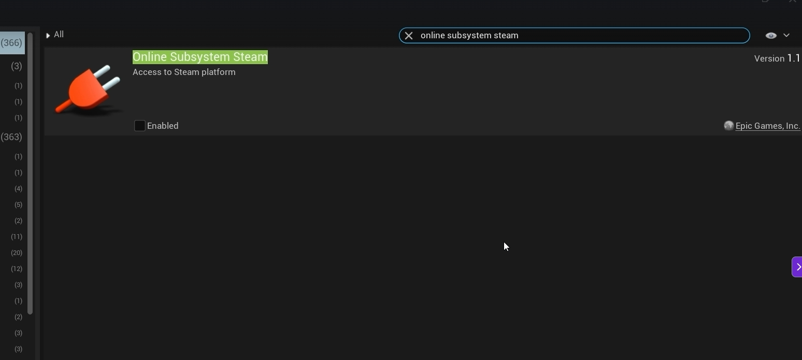
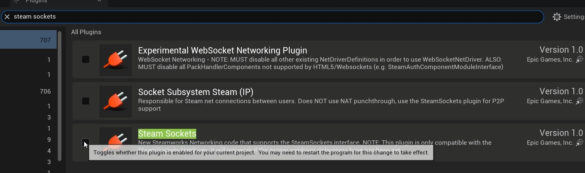
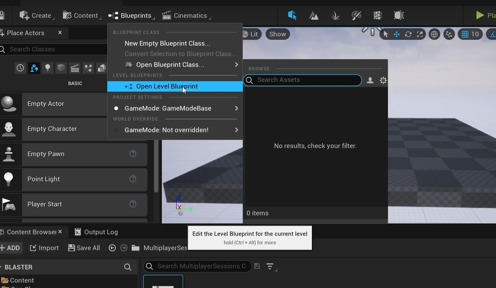
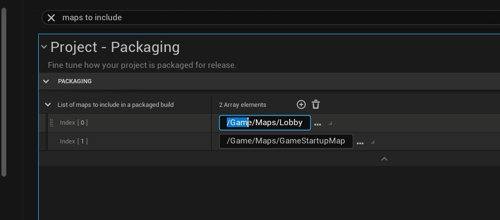
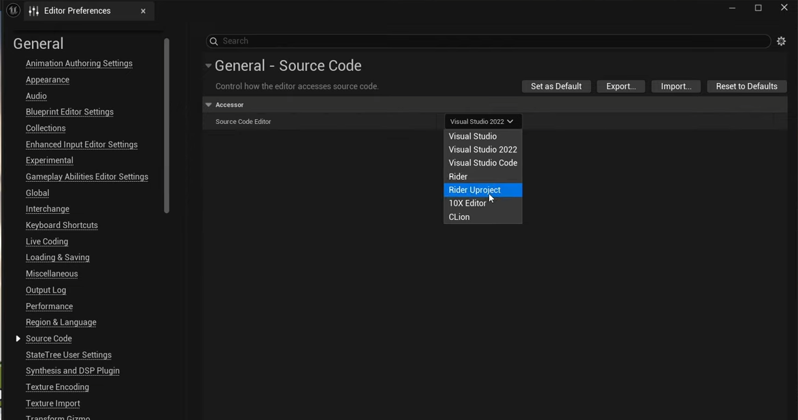
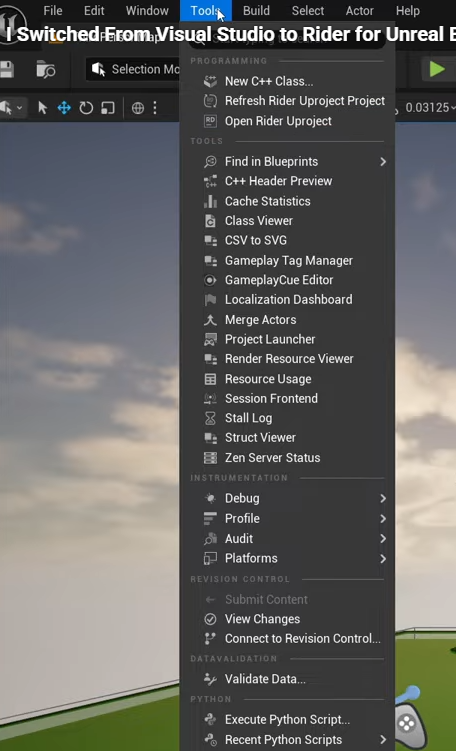
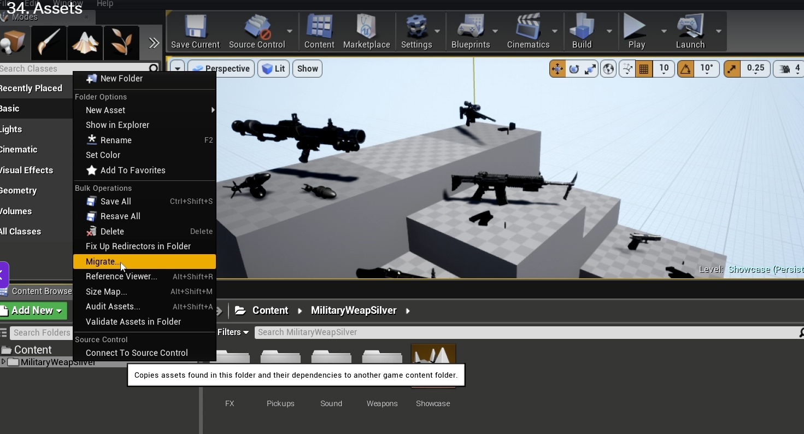
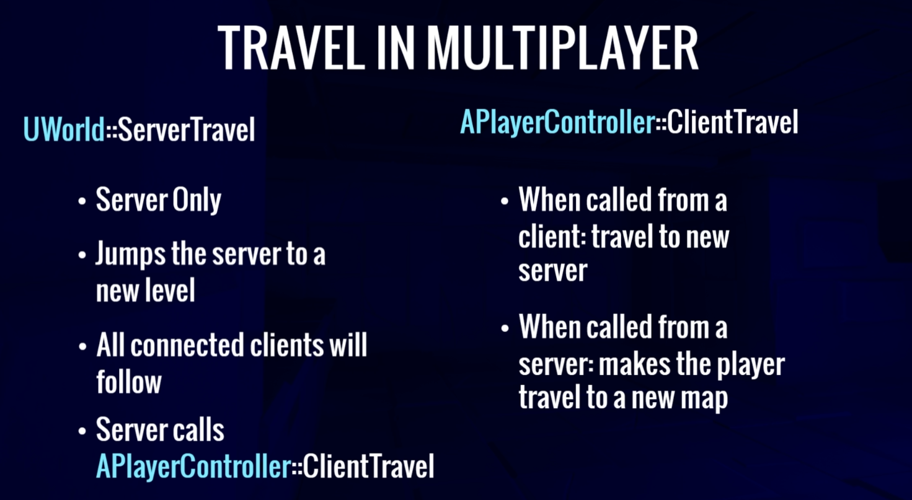

## 1. 多人游戏开发

### 1. 启动 Steam 插件

# 2. config 配置修改后重新生成project

DefaultEngine.ini

DefaultGame.ini 

saved/Binares/Intermediate 文件删除

#3.  开场关卡（GameStartup）蓝图启动的时候添加插件UI  WBP  

project Setting 设置GameStartup

Lobby 大厅路径

 # 4.

# 5, visual studio 转为rider

## 1.默认打开方式改为rider

## 2.refresh 和open rider

# 旧资源迁移导入

# Seamless Travle

为了保证多人玩家进入场景的一致性，避免出现因为地图重新加载导致，连接断开。

开启方式：在游戏模式中  bUseSeamlessTravel = true

需要一个transition map  

通过gamemode 方式 se'h

# Network Role

## 核心权限（Role）有三种

为了让你更好理解，我们先明确这三种常见权限到底代表谁：

1. **`Authority`（权威）**：绝对控制权。**永远属于服务器（Server）**。
2. **`Autonomous Proxy`（自治代理）**：预测控制权。**属于控制这个角色的本地玩家（你自己）**。
3. **`Simulated Proxy`（模拟代理）**：只能看不能动。**属于你眼中的其他玩家（别人）**。

## 针对服务器、你自己、其他玩家的区别

由于同一段代码可以在服务器上运行，也可以在客户端上运行，所以 `GetLocalRole` 和 `GetRemoteRole` 的返回值会根据**代码在哪里运行**而发生反转。

### 视角 1：在你的客户端（Client）上运行

假设你是玩家 A，正在玩游戏。在你的电脑上：

| **你在看谁的 Pawn？** | **GetLocalRole() (你电脑的权限)**  | **GetRemoteRole() (网络另一端的权限)** |
| --------------------- | ---------------------------------- | -------------------------------------- |
| **你自己 (玩家 A)**   | **Autonomous Proxy** (你能操控它)  | **Authority** (远端是服务器，它是老大) |
| **其他玩家 (玩家 B)** | **Simulated Proxy** (你只能看他走) | **Authority** (远端依然是服务器)       |

### 视角 2：在服务器（Server）上运行

假设代码现在运行在服务器上（比如 Dedicated Server）：

| **服务器在看谁的 Pawn？** | **GetLocalRole() (服务器的权限)** | **GetRemoteRole() (网络另一端的权限)**          |
| ------------------------- | --------------------------------- | ----------------------------------------------- |
| **任何连接进来的玩家**    | **Authority** (服务器始终是老大)  | **Autonomous Proxy** (远端是操控这个Pawn的玩家) |
| **服务器生成的AI野怪**    | **Authority**                     | **None / Simulated Proxy**                      |

# 第三章 总结

xxxxxxxxxx 一个 SM 内：- CUDA Cores（FP32）: 128   <- 普通 Shader 运算- INT32 Cores       : 64    <- 整数运算，可与 FP32 并行- Tensor Cores      : 4     <- 矩阵运算，AI / DLSS- RT Cores          : 1     <- 光线求交，DXR 光追- SFU               : 若干  <- sin/cos/sqrt 等超越函数text

BlasterAnimInstance ：动作装态的控制，movement 获取当前的character的参数，用来传递给动画蓝图

GameMode ：指定Level 状态。例如默认Character，设置semlesstravel 

蓝图：BP_BlasterCharacter  设置动画蓝图，动画骨骼

BlasterAnimBP :设置动画状态机

