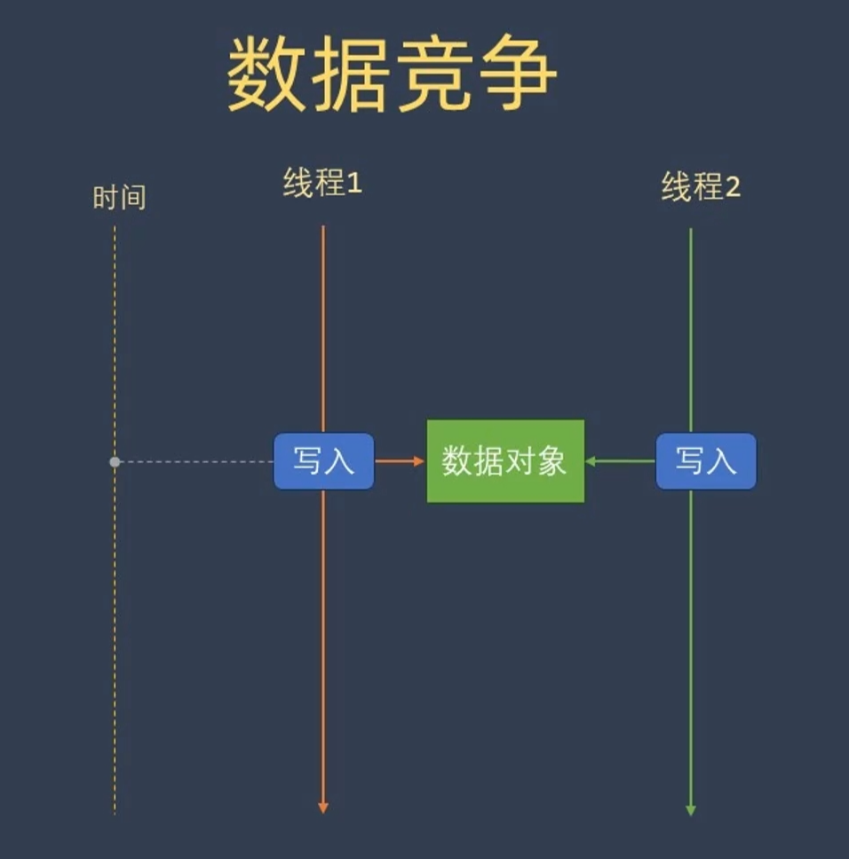

# 1.使用原因

1.任务分解：耗时任务，任务分解，实时响应

2.数据分解：充分利用多核心CPU

3.数据流分流

# 2.核心概念
## 1.std::thread 基础

​	join():主线程等待阻塞子线程完成后,回收子线程资源，线程生命周期受控；

​	detach(): 子线程与主线程分离,子线程后台游离运行。主线程销毁后，子线程会强行销毁。如果访问y

```C++
#include<thread>

thread t1(worker);
......
t1.join() / t1.detach();
```

## 2.Mutex & RAII 锁



​	mutex (互斥量)类型:允许多个线程安全访问变量 

```C++
lock()	try_lock()  unlock()
```

1. mutex

2. recursive_mutex :用来解决递归调用lock_guard(mtx)

   ```C++
   class DoSomething{
   public:
       int fun1(){
           std::lock_guard lock(mtx);
           count*=2;
           fun2();
           return count;
       }
       int fun2(){
           std::lock_guard lock(mtx);
           count++;
       }
   private:
       recursive_mutex mtx;//如果是mutex 会阻塞主线程
       int count = 0;
   }
   ```

   

​	

1. timed_mutex:

   ```C++
   class TryDemo
   {
   public:
       void print() {
           for (int i = 0; i < 10; i++)
           {
               //
               auto deadline = std::chrono::steady_clock::now() + std::chrono::milliseconds(100);
   
               unique_lock<timed_mutex> lock(m_mutex, defer_lock);
               if (lock.try_lock_for(100ms)) {
                   {
                       std::lock_guard guard(cout_mutex);
                       cout << "[" << this_thread::get_id() << "]" << "成功;\n";
                   }
                   this_thread::sleep_for(100ms);
               }
               else {
                   lock_guard guard(cout_mutex);
                   cout << "[" << this_thread::get_id() << "]" << "失败;\n";
                   this_thread::sleep_for(100ms);
               }
           }
       }
   private:
       timed_mutex m_mutex;
       mutex cout_mutex;
       int m_count = 0;
   
   };
   
   int main(void)
   {
       TryDemo demo;
       auto print = [](TryDemo& demo)
           {demo.print(); };
   
       thread t1(print, ref(demo));
       thread t2(print, ref(demo));
       t1.join();
       t2.join();
   
   }
   ```

   lock	 try_lock 	try_lock_for	 try_lock_until	 unlock

2. shared

1.如果只是用mutex会忘记没有解锁，2出现异常也不会解锁。导致永久阻塞所以引进

引入锁包装:

1. lock_guard;  相当通过RAII 将mutex 的lock() 和unlock() 封装了，离开作用域后析构函数调用unlock（）

```C++
template <typename Mutex>
class lock_guard
{
public:
	explicit lock_guard(Mutex &m):m_mutex(m)
	{
		m_mutex.lock();
	}
	lock_guard(Mutex& m,adopt_lck_t) noexcept:m_mutex(m){};
	
	~lock_guard()
	{
		m_mutex.unlock();
	}
	lock_guard(const lock_guard &)=delete;
	lock_guard &operator=(const lock_guard&)=delete;
}
```


2. unique_lock：相比lock_guard 更加灵活,可以实现延迟加锁或者超时的加锁。

​		lock() 	try_lock 	try_lock_for	try_lock_until(计时锁)	unlock 

​	


1. scoped_lock;

​	死锁预防
1. lock()同时锁多个
2. std::lock_guard顺序


   

## 3.Condition Variable


## 4.Condition Variable
## 5. autmic & Memory
## 6. Lock-Free 数据结构
## 7.Future/Promise/Async
## 8.ThreadPool & JobSystem
## 9.游戏引擎多线程模式