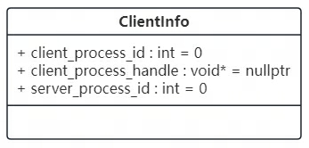
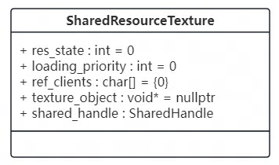
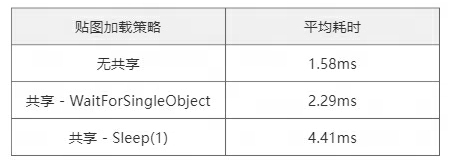
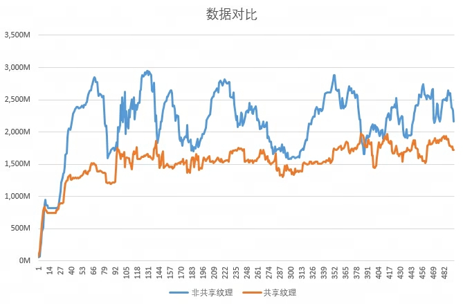
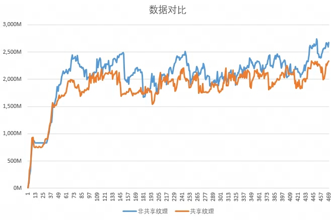

## 技术概述

通过创建一个“共享显存服务进程”（下文简称**共享进程**），把所有客户端的纹理创建/加载请求统一转发到共享进程执行，从而实现一个**跨进程的纹理资源管理器**（同一份纹理只创建一次，多客户端复用同一块显存）。

# **问题背景**

1. 某大型端游/客户端应用存在“多开”使用场景，且大量视觉效果由 2D 序列帧纹理驱动。多开时每个客户端重复加载同一批资源，会导致显存总占用快速升高；显存压力过大时，可能出现资源分配失败甚至进程崩溃。
2. 多开往往具有较高内容相关性（例如多个客户端在同一场景/同一队伍内），意味着**加载集合高度重叠**。如果能把“相同资源只加载一次并跨进程共享”，则总显存占用可进一步下降。

# **技术思路**

1. Direct3D 11 支持共享资源（shared resource / shared handle）。一个进程创建的纹理可以通过共享句柄让另一个进程打开并使用。
2. 客户端启动时创建或连接共享进程；客户端侧所有纹理创建请求都转发给共享进程执行。
3. 客户端与共享进程之间的控制面通信使用**共享内存**（元信息、状态、句柄等），数据面仍由 GPU/驱动完成真正的资源共享。

# **技术实现**

**1. 前置说明**

1.1 客户端进程与共享进程可以复用同一个可执行文件，通过不同启动参数进入不同代码分支，便于部署与维护（不必额外分发第二个可执行文件）。

1.2 该方案要求运行在支持“共享句柄资源”的渲染后端（本文以 D3D11 为例）。

1.3 共享内存底层可使用 `boost::interprocess`（减少 Win32 API 自行封装成本）。

**2. 创建/连接共享进程**

2.1 客户端启动后先检查共享进程是否存在（例如：共享进程启动时创建命名 `mutex`）。若不存在则 `CreateProcess` 拉起，否则直接连接。

2.2 连接共享进程可通过一块共享内存实现：由共享进程创建一段“客户端连接表”，保存一个定长数组（最大客户端数，示例为 64）。每个数组元素保存客户端连接所需的最小信息（例如：`client_process_id`、`server_process_id`、`client_index` 等）。共享进程启动时写入自己的 `server_process_id` 供客户端读取。



客户端连接信息（示意）

2.3 客户端连接过程：遍历数组找到 `client_process_id == 0` 的空槽位，取得该槽位的 `client_index`（用于标识“哪个客户端在引用资源”）；写入自己的 `client_process_id`；再用 `server_process_id` 打开共享进程句柄，用于后续检测共享进程是否意外退出。

主要代码（示例，已脱敏/简化）如下：

```cpp
// 共享内存中保存的连接表（示意）
struct ClientInfo {
  uint32_t client_index = 0;
  uint32_t client_process_id = 0;
  uint32_t server_process_id = 0;
  void* client_process_handle = nullptr; // 仅示意：实际用 HANDLE
};

if (m_client_index < 0) {
  // 找到自己的 client_index（占用一个空槽位）
  for (int index = 0; index < MAX_SHARED_RESOURCE_CLIENTS; ++index) {
    auto& client_info = clients[index];
    if (client_info.client_process_id == 0) {
      m_client_index = static_cast<int>(client_info.client_index);
      break;
    }
  }
}

if (m_client_index >= 0) {
  // 写入客户端 PID，并获取共享进程句柄用于存活检测
  auto& client_info = clients[m_client_index];

  // 权限尽量收敛：这里只需要用于 WaitForSingleObject/存活检测时，SYNCHRONIZE 通常足够
  m_server_process_handle =
      ::OpenProcess(SYNCHRONIZE, FALSE, client_info.server_process_id);

  client_info.client_process_id = ::GetCurrentProcessId();
}
```

2.4 共享进程启动后持续遍历连接表：对 `client_process_id > 0` 且 `client_process_handle` 为空的条目，调用 `OpenProcess(SYNCHRONIZE, ...)` 获取句柄，用于后续检测客户端是否退出。

主要代码（示例，已脱敏/简化）如下：

```cpp
for (int index = 0; index < MAX_SHARED_RESOURCE_CLIENTS; ++index) {
  auto& client_info = clients[index];
  if (client_info.client_process_id > 0 && client_info.client_process_handle == nullptr) {
    client_info.client_process_handle =
        ::OpenProcess(SYNCHRONIZE, FALSE, client_info.client_process_id);
  }
}
```

**3. 创建共享纹理**

3.1 共享进程在启动时会创建一块共享内存，我们称之为“共享信息表”。它以（key，value）的方式存放（资源键，纹理信息）的映射（例如：key 可为“资源逻辑路径/资源 ID/Hash”，本文用“纹理路径”描述）。



共享纹理信息（示意）

值得一提的是 `ref_clients` 这个成员：不同于单进程的普通引用计数（只记录总数），这里需要能定位“引用来自哪个客户端”。因为一旦某个客户端崩溃，必须能精准地剔除该客户端的引用，否则共享表会产生“幽灵引用”导致资源无法回收。一个简单做法是用数组记录每个 `client_index` 的引用计数。

3.2 客户端在请求纹理时：先从共享信息表查找是否已有条目；没有则创建；然后更新加载优先级并增加引用。

主要代码（示例，已脱敏/简化）如下：

```cpp
SharedTextureInfo* SharedTextureClient::find_or_create(const char* res_key,
                                                      Priority priority) {
  auto* shared_res = shared_memory.texture_map->find_or_construct(res_key)();

  shared_res->loading_priority = std::max(priority, shared_res->loading_priority);
  shared_res->add_ref(m_client_index);

  return shared_res;
}
```

3.3 同时，共享进程会每帧遍历共享表，把其中状态为loading的纹理信息放到加载队列中进行加载，如果加载成功，会把纹理的句柄写到纹理信息的共享句柄条目中，并且把加载状态标记为成功，游戏客户端这个时候会轮询到该状态，然后通过纹理信息拿到共享句柄。

3.4 设备层加载实现（D3D11）：

- 共享进程创建纹理时需要设置共享标记，并用 `IDXGIResource1::CreateSharedHandle` 取到共享句柄。

```cpp
// 共享进程侧：创建可共享的 Texture2D，并导出 shared handle
D3D11_TEXTURE2D_DESC desc = {};
// ... 填充 Width/Height/Format/BindFlags 等 ...
desc.MiscFlags |= (D3D11_RESOURCE_MISC_SHARED | D3D11_RESOURCE_MISC_SHARED_NTHANDLE);

ComPtr<ID3D11Texture2D> texture;
HRESULT hr = d3d11->CreateTexture2D(&desc, initData, &texture);
if (SUCCEEDED(hr)) {
  ComPtr<IDXGIResource1> dxgi_res;
  hr = texture.As(&dxgi_res); // QueryInterface

  if (SUCCEEDED(hr)) {
    HANDLE shared_handle = nullptr;
    hr = dxgi_res->CreateSharedHandle(
        /*pAttributes=*/nullptr,
        /*dwAccess=*/DXGI_SHARED_RESOURCE_READ,
        /*lpName=*/nullptr,
        /*pHandle=*/&shared_handle);

    // shared_handle 写入共享信息表，供客户端读取并 Open
  }
}
```

- 客户端拿到共享句柄后，用 `ID3D11Device1::OpenSharedResource1` 打开对应纹理对象。

```cpp
// 客户端侧：根据 shared handle 打开 Texture2D
ComPtr<ID3D11Device1> d3d11_1 = GET_D3D11_DEVICE1();
ComPtr<ID3D11Texture2D> texture;

HRESULT hr = d3d11_1->OpenSharedResource1(
    shared_handle, __uuidof(ID3D11Texture2D),
    reinterpret_cast<void**>(texture.GetAddressOf()));
```

3.5 最后，如果共享纹理加载失败，游戏客户端就会fallback到本地创建纹理的流程。

**4. 共享纹理加载的实时性**

4.1 由于游戏客户端纹理加载有可能在主线程发生，所以如果加载太慢，就会导致客户端卡顿。

4.2 在共享进程这一架构下，我们要获得较优的加载速度，首先游戏客户端轮询加载状态一定要足够及时，不能等到加载状态都已经改变很久（比如几十毫秒）以后才轮询到；其次，共享进程的加载纹理也要足够的及时，共享进程加载纹理的及时性取决于遍历共享表的速度、同时需要加载的任务数量以及创建纹理速度等几个方面。

4.3 最简单的做法就是客户端采用超时死循环的方式轮询加载状态，然后共享进程也采用死循环的方式遍历共享表并执行加载任务。很显然这种做法是不切实际的，虽然实时性有保证，但会带来巨大的cpu消耗，这种消耗是我们不能接受的，所以我们需要在实时性以及cpu消耗之间做一个平衡。

4.4 直接的思路就是客户端在轮询加载状态的时候做一个短时间的sleep（比如1毫秒），这样就能极大的降低cpu占用，但sleep存在一个弊端就是它会释放当前线程的剩余时间片，如果玩家机器上cpu负载较高，sleep的唤醒就有可能不那么及时从而导致一些轻微的卡顿。

4.5 最终可用 `WaitForSingleObject` 来实现“事件驱动的轮询等待”。相比 `Sleep`，等待内核对象在等待期间**不消耗 CPU 时间片**，且共享进程可以在任务完成时立刻触发事件使客户端及时唤醒。

做法：共享进程创建一个命名 `event`；每完成一次加载任务就 `SetEvent`；客户端轮询状态前先 `WaitForSingleObject(event, 1ms)`，等待成功则尽快检查状态；重复直到整体超时。

主要代码（示例，已脱敏/简化）如下：

```cpp
bool SharedTextureInfo::client_wait_ready(uint32_t timeout_ms, uint32_t wait_ms) {
  const clock_t start = ::clock();

  while (res_state == SharedResourceState::Loading) {
    if (timeout_ms > 0 &&
        ::clock() > start + static_cast<clock_t>(timeout_ms)) {
      return false;
    }

    if (wait_ms > 0) {
      SharedTextureClient::Instance().wait_loading_event(wait_ms);
    }
  }

  return res_state == SharedResourceState::Ready;
}
```

4.6 而共享进程这边的处理方法主要分为两方面：

- 遍历共享表以后，如果没有加载任务，就等待 1 毫秒释放 CPU；如果存在加载任务就执行加载任务，完毕后不会再做等待而是马上进入下一次的遍历，本质上是做有限的等待和积极的加载。
- 加载任务划分了优先级，游戏客户端主线程发起的加载任务定为高优先级，高优先级的任务会在遍历完共享表后一次加载完毕，而由客户端异步线程发起的加载任务定为低优先级，共享进程会在没有高优先级任务的情况下才会选择一个低优先级任务执行，这样能避免因为低优先级任务过多而高优先级任务加载不过来导致的卡顿。

4.7 共享加载跟正常加载的速度对比



5000张贴图在三种策略下分别的平均加载耗时

**5. 容灾处理**

5.1 只要是程序都有可能发生崩溃，共享进程也不例外，我们需要做到共享进程发生 crash 时尽量不影响客户端运行。否则在高并发多开场景下，多个客户端可能被同一个共享进程故障“连坐”而同时受影响。因此需要做好容灾处理：目标是共享进程崩溃对客户端不会造成影响，并且能自动重启，最好能恢复现场。

5.2 共享进程跟游戏客户端之间的共享内存有两块，一块是客户端连接数组，一块是共享信息表，其中共享信息表是在共享进程崩溃后依然存在的（只要游戏客户端没有全部退出），所以重启后依然可以继续使用块内存，但是里的数据需要进行处理。

5.3 处理方法相对直接：共享进程重启后遍历共享表，将纹理信息中的 `texture_object/shared_handle` 等运行时字段清空，并把 `res_state` 置为 `Error`。新客户端请求纹理时若发现状态为 `Error`，将其改回 `Loading` 触发共享进程重新加载。

需要注意：重新加载出的纹理与旧客户端仍持有的纹理，虽然资源键相同，但**并不一定指向同一份显存**。例如：客户端 A 通过共享进程创建了纹理 X；共享进程崩溃并重启后，客户端 B 再次请求纹理 X，此时 A 与 B 可能各自持有一份不同的显存副本。若共享进程反复崩溃，最坏情况会退化为“每个客户端一份”。（实际工程中可结合心跳/版本号/句柄有效性校验/更强的故障隔离策略进一步约束。）

# **最终效果**

我们使用以下用例进行测试最终效果：

1. 多开客户端之间相关性较大时，使用与不使用共享进程后的“所有客户端总显存增长曲线”



“相关性较大”指多开客户端处在同一内容集合（例如同一场景/同一队伍），资源加载集合高度重叠。这种情况下共享进程能明显降低贴图加载引起的显存波动，总体显存占用也更低。

2. 多开客户端之间相关性较小时，使用与不使用共享进程后的“所有客户端总显存增长曲线”



相关性较小意味着各客户端看到的内容差异更大。此时共享带来的收益会下降，但仍可复用主界面、预读资源等“基础公共纹理”，因此通常仍能降低一定的显存占用。

# **工程注意事项（补充）**

1. **句柄权限与安全性**：示例代码中建议将 `OpenProcess` 权限收敛到最小集合（例如存活检测使用 `SYNCHRONIZE`）。共享句柄也应按实际需求选择 `DXGI_SHARED_RESOURCE_READ` 或更高权限，避免“为了省事全开”。
2. **资源键设计**：不要依赖真实磁盘路径/项目内部资源路径作为 key。工程上更稳妥的是使用“逻辑资源 ID”或“内容 Hash”，既利于脱敏，也利于规避路径差异导致的无法命中共享。
3. **生命周期与回收**：跨进程共享时，引用来自多个客户端，必须能定位每个客户端的引用（本文用 `ref_clients[client_index]`），并处理“崩溃/异常退出”的引用清理。
4. **同步策略**：客户端侧等待要兼顾实时性与 CPU 占用。事件驱动 + 短超时是一种常用折中；更复杂的策略可以结合批量触发、加载队列长度、优先级与时间片预算。

# **参考资料**

- Direct3D 11 资源共享概念与 DXGI 共享句柄：`https://learn.microsoft.com/windows/win32/direct3d11/d3d11-graphics-programming-guide-resources`、`https://learn.microsoft.com/windows/win32/api/dxgi1_2/nf-dxgi1_2-idxgiresource1-createsharedhandle`
- `ID3D11Device1::OpenSharedResource1`：`https://learn.microsoft.com/windows/win32/api/d3d11_1/nf-d3d11_1-id3d11device1-opensharedresource1`
- `WaitForSingleObject` / 事件对象（Event Objects）：`https://learn.microsoft.com/windows/win32/api/synchapi/nf-synchapi-waitforsingleobject`、`https://learn.microsoft.com/windows/win32/sync/event-objects`
- Boost.Interprocess：`https://www.boost.org/doc/libs/release/doc/html/interprocess.html`