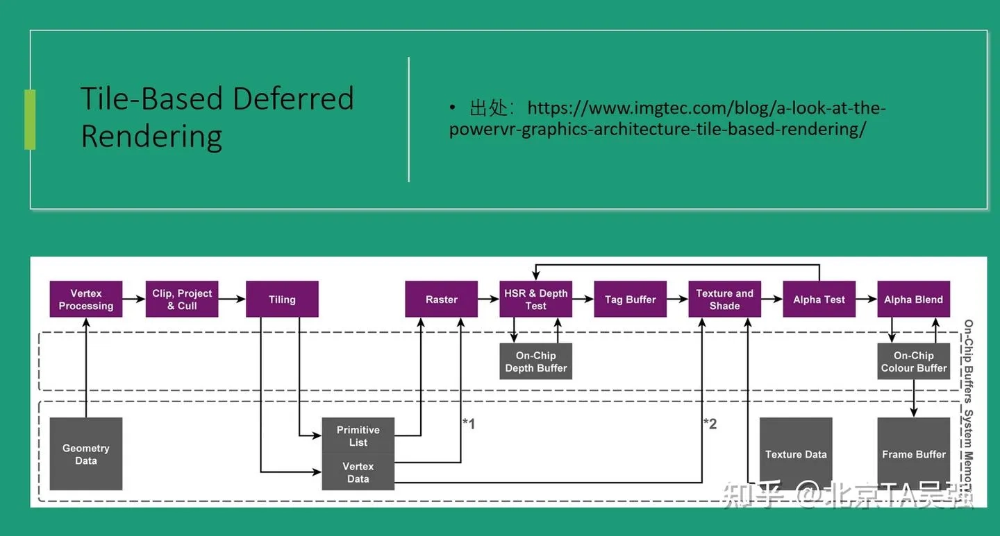

## 1. 流程图

## Tile-Based Deferred Rendering (TBDR) 流程图讲解

这是 PowerVR GPU 的 TBDR 渲染架构流程图，分为两大阶段：**几何阶段**和**渲染阶段**，核心特点是利用片上缓存（On-Chip Buffers）减少对系统内存的读写。

---

### 第一阶段：几何处理（Geometry Phase）

**① Vertex Processing（顶点处理）**

- 执行顶点着色器，完成坐标变换、光照计算等
- 输入来自系统内存中的 **Geometry Data（几何数据）**

**② Clip, Project & Cull（裁剪、投影与剔除）**

- 将顶点从世界空间变换到裁剪空间
- 剔除视锥体外的图元，减少后续计算量
- Cull：剔除，视锥体外
- Clip：裁剪，一部分视锥体内，一部分视锥体外

**③ Tiling（分块）**

- 将屏幕划分为若干小块（Tile），判断每个图元属于哪些 Tile
- 输出 **Primitive List**（图元列表）和 **Vertex Data**（顶点数据）存入系统内存
- ⚠️ 这是 TBDR 的关键步骤，后续按 Tile 逐块处理

---

### 第二阶段：逐 Tile 渲染（Rendering Phase）

> 以下阶段对每个 Tile 独立执行，数据尽量留在片上缓存中

**④ Raster（光栅化）**

- 读取 Primitive List 和 Vertex Data（*1 标注处）
- 将图元转换为像素片元（Fragment）

**⑤ HSR & Depth Test（Hidden Surface Removal + 深度测试）**

- PowerVR 的核心优化：在着色**之前**就完成深度测试
- 利用片上的 **On-Chip Depth Buffer** 剔除被遮挡的像素
- 确保每个像素只有**可见的片元**才进入后续着色，避免 Overdraw
  - 对 Tile 内每个像素位置：遍历覆盖该像素的所有图元，比较深度值，找出最终可见的那一个，写入 Tag Buffer

**⑥ Tag Buffer（标记缓冲）**

- 记录每个像素最终可见的片元信息
- 作为 HSR 的输出，指导后续着色哪些片元需要处理

**⑦ Texture and Shade（纹理采样与着色）**

- 执行片元着色器，进行纹理采样（*2 从系统内存读取 **Texture Data**）
- 此时只对可见像素着色，极大节省性能

**⑧ Alpha Test（Alpha 测试）**

- 根据透明度阈值丢弃不需要的片元（如镂空贴图）

**⑨ Alpha Blend（Alpha 混合）**

- 处理半透明效果，将当前片元与 **On-Chip Colour Buffer** 中的颜色混合

**⑩ Frame Buffer（帧缓冲写出）**

- 整个 Tile 渲染完毕后，才将结果从片上缓存写回系统内存的 **Frame Buffer**
- 这是唯一一次大规模写系统内存的操作

---

### 核心优势总结

| 特性         | 传统 IMR       | TBDR                 |
| ------------ | -------------- | -------------------- |
| 深度测试时机 | 着色后         | 着色前（HSR）        |
| Overdraw     | 大量存在       | 几乎消除             |
| 内存带宽     | 频繁读写       | 片上缓存，最后才写回 |
| 适用场景     | 桌面高性能 GPU | 移动端（省电省带宽） |
