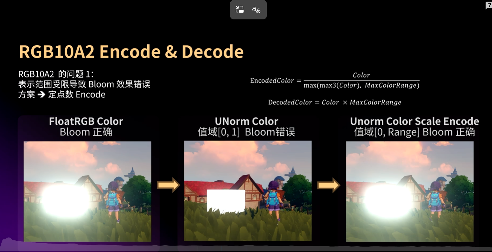

# 1.减少带宽和显存消耗

## 2.减少渲染中pass切换的数目来降低带宽

### 1.opengl es 中使用 Framebuffer Fetch

### 2. Vulkan 使用subpass  来减少带宽

例如 ，延迟渲染中的GBuffer 和lighting pass 两个pass如果执行了endpass 会将one-chip-memory store 到系统内存中。下个pass 要Load one-chip-memory 里。 通过subpassLoad 将利用tile 中的数据计算。
### 3. 每一帧显式提交一个Clear 减少 Tile Load

## 3.带宽压缩
### 1. ASTC 贴图格式压缩。不同资源压缩比例不同 4*4 -8*8 。
### 2.降低RT 精度 

# 2.erly z,HSR 硬件像素剔除比较关键

1.半透明材质不受HSR  overdraw 
2.alpha test 材质会破坏HSR ，所以放到，不透明物体最后渲染

# 2.实际项目优化示例

## 1.洛克王国
https://www.bilibili.com/video/BV1XK1YB4EyJ/?spm_id_from=333.1391.0.0&vd_source=c41c590d451803fc1f5905563f54cbb3

## 1.1  buffer 图像格式从FP16 转为rgb10a2 格式。减少了带宽开销。

## 同时导致了以下图像问题

## 1产生色阶: 像素值接近0的区域导致的，通过开平方根的方法实现在0附近分配更多的空间。扩展思考也可以用抖动方式解决色阶

## 2.HDR 功能失效,无法实现bloom 	

## 						

通过编码

