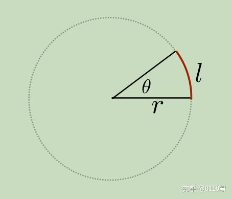
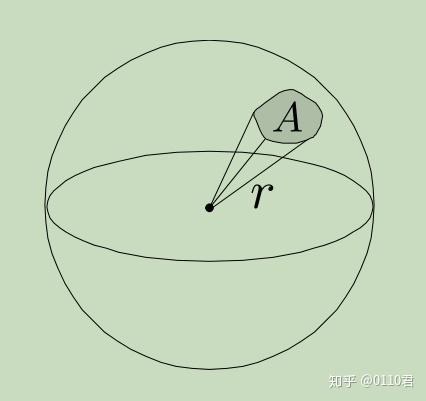

## 1. 概念

### 1. 角度：2D 平面角 弧长/半径

### 2. 立体角（Solid Angles）：投影面积 / 半径的平方

### 3. 辐射能 (Radiant Energy)

### 4. 辐射通量 (Radiant Flux)：Radiant Energy / 单位时间

### 5. 辐射强度 (Radiant Intensity)：Radiant Flux / 单位立体角

### 6. 辐照度 (Irradiance)：Radiant Flux / 单位面积

### 7. 辐出度 (Radiant Exitance)：Radiant Flux / 单位面积

### 8. 辐亮度/辐射度 (Radiance)：Radiant Flux / 单位面积 / 单位立体角

| 物理量名称（中文）       | 物理量名称（英文）   | 符号      | 单位                     | 定义与解释                                         |
| ------------------------ | -------------------- | --------- | ------------------------ | -------------------------------------------------- |
| **辐射通量**             | Radiant Flux / Power | \(\Phi \) | **\(W\)** (瓦特)         | 单位时间内发射或接收的总能量。                     |
| **辐照度**               | Irradiance           | \(E\)     | **\(W/m^2\)**            | 单位**表面积**上接收到的辐射通量（入射光）。       |
| **辐出度**               | **Radiant Exitance** | \(M\)     | **\(W/m^2\)**            | 单位**表面积**上发射或反射出的辐射通量（出射光）。 |
| **辐射强度**             | Radiant Intensity    | \(I\)     | **\(W/sr\)**             | 单位**立体角**内发射的辐射通量。                   |
| **辐亮度**/辐射度/辐射率 | Radiance             | \(L\)     | **\(W/(m^2 \cdot sr)\)** | 单位**垂直表面积**、单位**立体角**内的辐射通量。   |

反射方程：$w_o$ 反射出的辐射率 = BRDF × $L_o$ 入射辐射率 × 法线方向和入射光线的点积，立体角半球积分，模拟半球上从不同角度入射的光线

$$
d\omega = \sin\theta \, d\theta \, d\phi
$$

PBR 反射方程：
